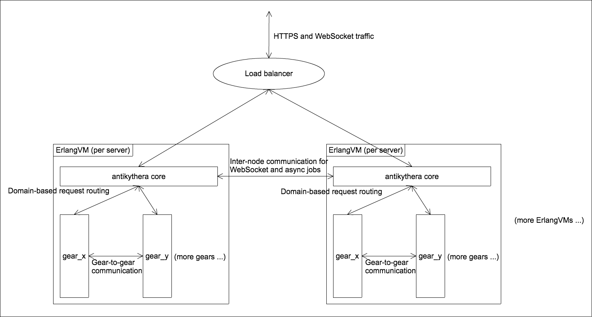

# Antikythera Framework

**Antikythera** is an [Elixir] framework to build your own in-house PaaS (Platform as a Service).

You can run multiple web services while managing only a single cluster of [ErlangVM][Erlang] nodes.
From the viewpoint of service developers antikythera provides FaaS(Function as a Service)-like development experiences.

[Elixir]: https://elixir-lang.org/
[Erlang]: https://www.erlang.org/

**Note:** Antikythera is already used in production at [ACCESS],
though as an OSS, it is still in early development stage and missing many components.
Please be aware of that, and stay tuned for further additions!

[ACCESS]: https://www.access-company.com/

## Features

- As a platform for multiple services:
    - Resource control for multi-service and multi-tenant use cases
    - Automated deployment without affecting other running services
    - Built-in logging, monitoring and configuration management
    - Service-to-service communications without network overhead
- As a web framework:
    - HTTP request processing with arbitrary Elixir code with WebSocket support
    - Domain-based routing for multiple services; path-based routing within single service
    - CDN support for static contents, HAML template for dynamic web pages
- As an asynchronous job executor:
    - Built-in distributed job queues
    - Running arbitrary Elixir code for each job

## Basic architecture

- We refer to each antikythera cluster as an **"antikythera instance"**,
  and each web service running within an antikythera instance as a **"gear"**.
    - Antikythera Instance example: [antikythera_instance_example](https://github.com/access-company/antikythera_instance_example)
    - Gear example: [testgear](https://github.com/access-company/testgear)
    - These two projects are also used for antikythera's test.
- Antikythera is heavily dependent on the power of [ErlangVM][Erlang].
    - Antikythera is written in [Elixir], and all gears must also be written in Elixir.
- Multiple gears are co-located and executed within the same ErlangVMs of an antikythera instance.
    - This type of co-location of multiple applications are sometimes referred to as "nano-services architecture".
    - This way we can eliminate the infrastructure/operational cost for having multiple web application stacks.
    - Also, inter-service communications in a micro-services architecture become gear-to-gear communications in this nano-services architecture.
      Unlike micro-services architecture, it doesn't require network roundtrip as all gears are running within a single ErlangVM, resulting in lower communication overhead.
    - Although gears share the same computing resources, they are executed in an independent manner thanks to the Erlang's process model.
    - Antikythera instance and its gears are all separate [mix](https://hexdocs.pm/mix/Mix.html) projects.
        - Developers of different gears can work on their own projects, independently.
        - Library dependencies are defined per-antikythera-instance, and all gears inherit those dependencies.

## Getting Started

See our [Getting Started](https://hexdocs.pm/antikythera/getting_started.html) guide!

## Documentation

- [For antikythera instance administrators](https://hexdocs.pm/antikythera/instance_administrators.html) (TBD)
- [For gear developers (i.e. developers of web services)](https://hexdocs.pm/antikythera/gear_developers.html)
- [API Reference](https://hexdocs.pm/antikythera/api-reference.html)

## Contributing

We encourage you to contribute to antikythera! Please check out our [Contributing Guide](https://github.com/access-company/antikythera/blob/master/CONTRIBUTING.md).

For both core and gear development, please make use of our [Style Guide](https://github.com/access-company/antikythera/blob/master/STYLE_GUIDE.md).

- [Issue Tracker](https://github.com/access-company/antikythera/issues)
- [Users Mailing List](https://groups.google.com/forum/#!forum/antikythera_users)

## Copyright and License

Copyright(c) 2015-2023 [ACCESS CO., LTD][ACCESS]. All rights reserved.

Antikythera source code is licensed under the [Apache License version 2.0](./LICENSE).
