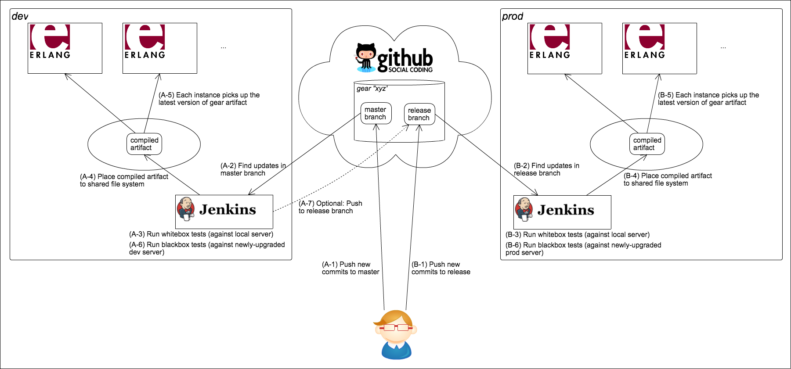

# Deployment to Antikythera Instance

**Note:** This page is being updated for OSS release. Please be patient.
Current contents describes how our antikythera instance and gears are deployed in [ACCESS](https://www.access-company.com).

## Antikythera's deployment policy

- Antikythera itself is regularly deployed to both dev and prod environments in the same way as gears described below.
- For the following purposes antikythera expects each gear to be deployed at least once per month to both dev and prod environments.
    - to keep gears and antikythera in sync,
    - to smoothly phase out deprecated symbols (especially for macros as they require re-compilation and re-deploy of all running gears),
      without too much communication overhead.

## Gear's git repository

- For automatic deployment, antikythera assumes that all gears' code is managed as follows:
    - Repository
        - Every gear implementation is expected to have its own repository in GitHub (dev/prod).
        - The repository in GitHub must belong to [access-company/Antikythera team](https://github.com/orgs/access-company/teams/antikythera)
          so that the antikythera team and antikythera's auto-deploy component have read/write access to it.
    - Branches
        - Antikythera treats the following 2 branches as deploy targets; the other branches are ignored.
            - `master` branch means "ready to deploy to dev environment".
            - `release` branch means "ready to deploy to prod environment".
        - Updates in these branches will be automatically deployed to the running antikythera system.

## Deployment flow

- Each of dev and prod environments runs its own jenkins server for automatic testing and deployment.

- Note that, in order to run a gear within live antikythera environments, it is necessary for the gear to use the latest version of antikythera.
    - The antikythera version used by gear is tracked by `mix.lock` file.
      You can manually update to the latest antikythera version by issuing `$ mix deps.update antikythera`.
    - If antikythera's auto-deploy component detects that a gear is referring to an outdated antikythera version, then
        - in dev environment it automatically tries to update the antikythera dependency (i.e. perform git-push to `origin/master`) and try again.
        - in prod environment: it rejects the gear version.

## About jenkins job settings

- Jenkins servers in dev/prod environment contain deployment jobs per existing gear (and a few jobs for antikythera system operations).
- The settings of these jenkins jobs are pre-configured and should not be altered, aside from the following exception.
    - If you want to trigger deployment to prod after successful deployment to dev,
      you can setup "Git publisher" of your gear's deploy job so that it automatically propagate changes in `master` to `release`.
      (This configuration is currently active by default)

## Tests executed by jenkins during deploy jobs

- All the following tests are executed in the same way as normal development environment:
    - Before deployment: `$ mix test`
    - After deployment: `$ TEST_MODE=blackbox_dev mix test` or `$ TEST_MODE=blackbox_prod mix test`
- (See [here](https://hexdocs.pm/antikythera/testing.html) for more about whitebox/blackbox tests)

## Troubleshoot errors during deploy

- If you encounter an error about antikythera's mix configuration during deployment of your gear,
  it might be caused by changes in `mix.exs` and/or `mix_common.exs` in antikythera repository.
  Please re-run the deploy job a few times and see if it works.
