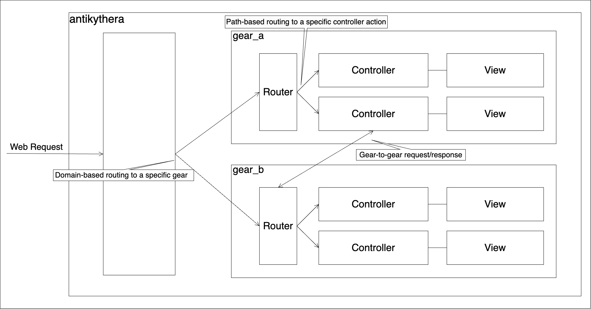

# Web Requests Routing

**Note:** This page is being updated for OSS release. Please be patient.

- Antikythera's web request router consists of the following 2 stages:
    - Domain-based routing
    - Path-based routing
- This process is schematically shown in the following flow diagram:

## Domain-based routing to a specific gear

- Antikythera hosts multiple running gears and incoming web requests are routed based on the domain part of the URL.
- When a gear is started, antikythera's routing layer registers the domains of the gear and subsequent requests to the domains will be routed to the gear.
- Each gear's domain is configurable and defaults to the following subdomain (note that `_`s in gear name are replaced by `-`s):
    - local environment: `<gear-name>.localhost:8080` (when you run `$ iex -S mix` in your gear project)
    - dev   environment: `<gear-name>.development.example.com`
    - prod  environment: `<gear-name>.production.example.com`

## Path-based routing to a specific controller action

- Once an appropriate gear for an web request is determined based on the domain part,
  antikythera then routes the request to a controller action by matching URL path and HTTP method.
- Gears must define the routing rules in `web/router.ex`.
    - Refer to `Antikythera.Router` for details of the routing DSL.
